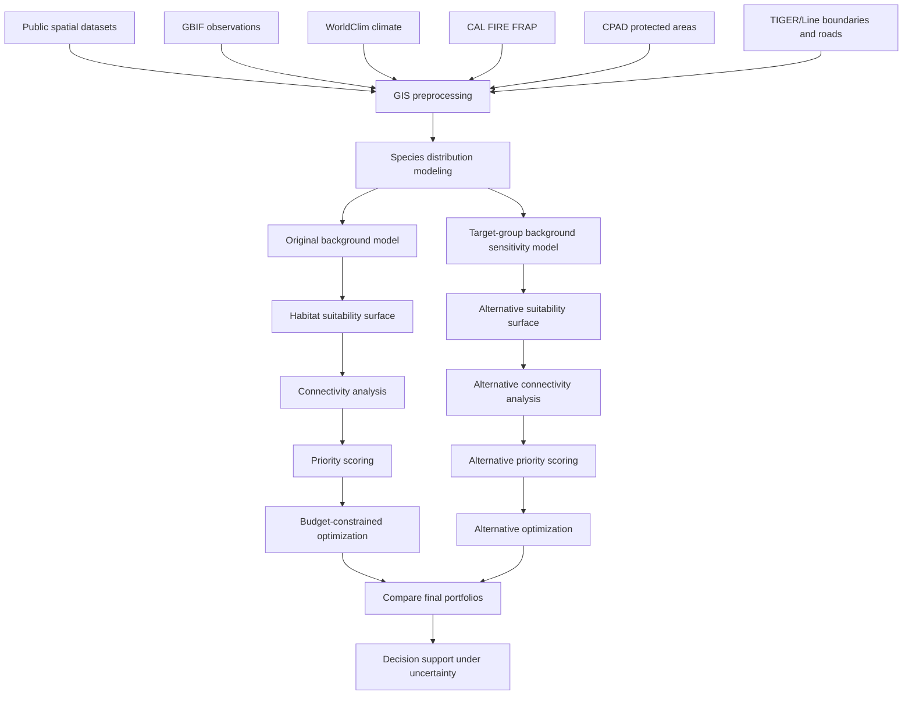
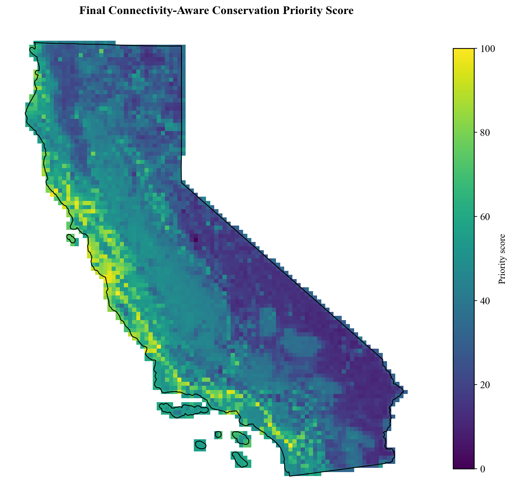
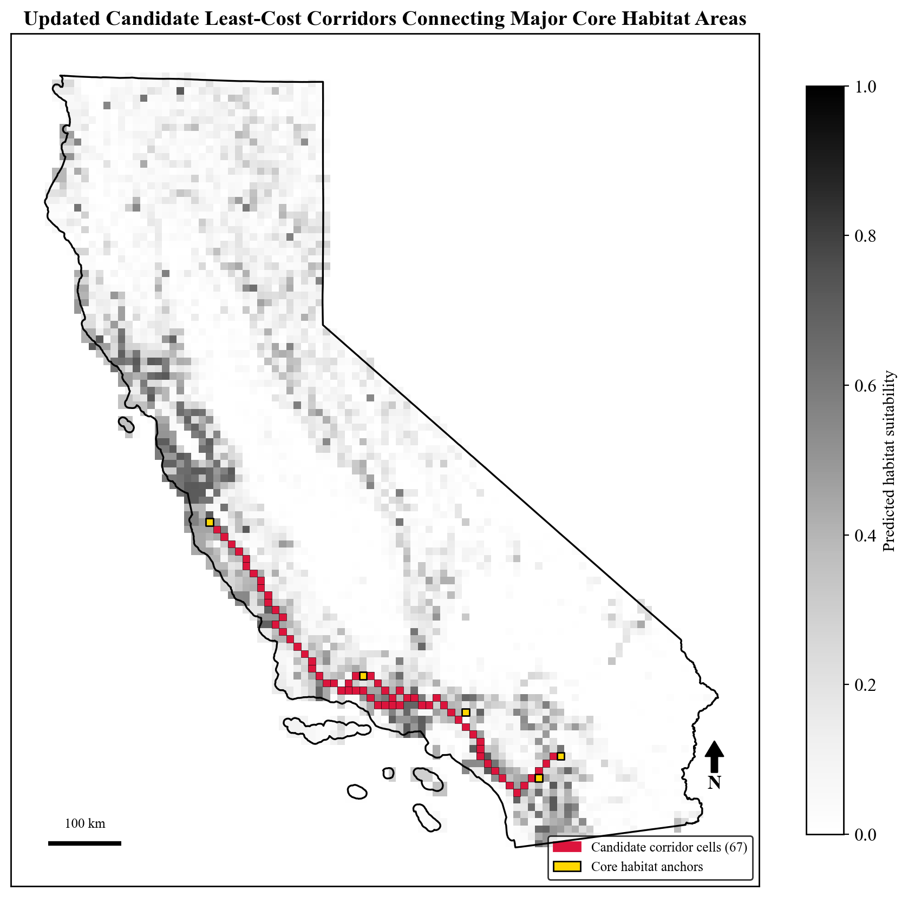

# How Should California Spend Limited Conservation Funding?

### A GIS, machine learning, and optimization framework for climate-resilient conservation planning

**Author:** AJ Sager  
**Project:** Climate-Resilient Conservation Prioritization Using GIS and Machine Learning  
**Demonstration species:** Mountain lion (*Puma concolor*) in California

[](https://www.python.org/)
[](LICENSE)
[]()
[]()

## Interactive Dashboard

Explore the conservation priority map, optimized portfolio, candidate corridors, and named priority planning units here:

[Open the interactive dashboard] https://ajsager21.github.io/conservation-dashboard/

---

## The Question

California has limited conservation funding, extensive habitat under pressure from development, wildfire, and climate change, and large-ranging wildlife species whose habitat needs extend far beyond existing protected areas.

This project asks:

> **If California could only fund a fraction of potential conservation land acquisition, where should those dollars go first?**

To answer that, I built a reproducible GIS decision-support framework that combines species distribution modeling, climate projections, protected-area data, wildfire history, habitat connectivity, sensitivity analysis, and budget-constrained optimization.

The case study uses mountain lions in California, but the workflow was designed to be transferable to other species, regions, and conservation planning problems.

---

## Project Workflow



---

## What This Project Demonstrates

This project is best understood as a **spatial decision-support framework** rather than a single static habitat map.

The workflow demonstrates how to:

- Build a 10km x 10km statewide GIS planning grid
- Model habitat suitability using machine learning
- Evaluate model performance with spatial block cross-validation
- Diagnose observation-effort bias in opportunistic wildlife sightings
- Construct an alternative target-group background model as a robustness test
- Translate habitat predictions into least-cost connectivity corridors
- Combine suitability, climate resilience, wildfire history, protection gaps, and connectivity into a conservation priority score
- Solve a budget-constrained land acquisition problem with integer programming
- Compare final recommendations against an independent conservation benchmark, CDFW ACE
- Identify which recommendations remain stable when the habitat model changes

---

## Key Results

| Component | Result |
|---|---:|
| Planning units | 4,498 California grid cells, 10km x 10km |
| Mountain lion records after filtering | 2,349 GBIF observations |
| Original Random Forest spatial AUC | **0.845** |
| Target-group background spatial AUC | **0.601** |
| Original vs. target-group habitat suitability correlation | **Spearman's rho = 0.483** |
| Full priority surface correlation after rebuilding both pipelines | **Spearman's rho = 0.657** |
| Top 5% final priority overlap | **29.8%** |
| Original optimized portfolio | **199 cells** |
| Target-group optimized portfolio | **236 cells** |
| Original optimized portfolio retained under target-group model | **64.8%** |
| Original priority vs. CDFW ACE biodiversity rank | **rho = 0.430** |
| Target-group priority vs. CDFW ACE biodiversity rank | **rho = 0.513** |
| Original top 10% priority cells in ACE top biodiversity tiers | **78.2%**, vs. 37.2% statewide baseline |
| Target-group top 10% priority cells in ACE top biodiversity tiers | **67.5%**, vs. 37.2% statewide baseline |

### Main takeaway

The habitat and corridor maps were sensitive to assumptions about observation effort, but the optimized conservation portfolio was more stable than the individual ecological layers. Roughly **65% of the original optimized portfolio remained selected** after rebuilding the full pipeline with an alternative target-group background model.

That result is important for conservation decision support: the framework does not require pretending that any single habitat model is perfect. It provides a way to quantify how much uncertainty in the habitat model affects the final investment recommendation.

---

## Why Observation Bias Matters

Mountain lion occurrence records from GBIF are opportunistic sightings. People are more likely to observe and report wildlife near roads, trails, towns, and other accessible areas. That creates a major modeling concern: a species distribution model may partly learn where people see wildlife rather than where wildlife is most likely to occur.

This project addressed that concern in three ways:

1. **Road-distance diagnostic:** A candidate distance-to-road predictor produced an ecologically suspicious signal and was excluded from the final model.
2. **Spatial block cross-validation:** Model performance was evaluated on spatially separated test blocks to reduce inflated accuracy from nearby training and test points.
3. **Target-group background sensitivity analysis:** The full pipeline was rebuilt using an alternative background sample drawn from four broadly observed California mammal species: coyote, bobcat, gray fox, and mule deer.

The target-group model performed worse under spatial validation, but it provided a useful stress test. It showed that specific habitat and corridor maps are sensitive to background-sampling assumptions, while many optimized investment priorities remain stable.

---

## Figures

### Figure 1. Manual occurrence proxy vs. ML-predicted habitat suitability

Citizen-science sightings alone cluster near accessible areas. The Random Forest model produces a broader predicted suitability surface based on environmental conditions, although the resulting map remains conditional on the assumptions of the occurrence model.


### Figure 2. Existing protection status

Percent of each grid cell under existing protection, calculated from CPAD Holdings.


### Figure 3. Final conservation priority score

A 0 to 100 score combining habitat suitability, fire frequency, existing protection, climate resilience, and connectivity.




### Figure 4. Least-cost candidate corridors

Candidate corridors connecting the five largest core habitat clusters. Corridor locations should be interpreted as model-dependent because the resistance surface is derived from predicted habitat suitability.



### Figure 5. Weight sensitivity analysis

Per-cell frequency of appearing in the top 50 priority cells across 500 randomly reweighted priority formulas.


---

## Budget-Constrained Optimization

The final optimization is formulated as a binary integer program. Each grid cell has an estimated acquisition cost based on unprotected acreage and a fixed transaction cost. The objective is to maximize total conservation priority while staying under a fixed statewide budget.

The base budget was set to approximately **$2.46 billion**, equal to about 2% of the estimated cost of protecting all remaining unprotected land in the study grid.

| Portfolio | Cells Selected | Interpretation |
|---|---:|---|
| Original full pipeline | **199** | Main optimized portfolio using the original spatially validated habitat model |
| Target-group sensitivity pipeline | **236** | Alternative optimized portfolio after rebuilding the full pipeline under target-group background assumptions |
| Shared cells | **129** | Cells selected by both optimized portfolios |
| Original portfolio retained | **64.8%** | Decision-level robustness under alternative observation assumptions |

The optimization stage was more stable than the habitat-suitability maps themselves. This suggests that multi-criteria decision frameworks can partially buffer uncertainty from any single model input, while still requiring transparent reporting of sensitive components.

---

## Methods Summary

| Stage | Approach |
|---|---|
| Spatial framework | 10km x 10km California grid, EPSG:3310, 4,498 cells |
| Species occurrence | GBIF via `pygbif`, filtered to human observations with <5km coordinate uncertainty |
| Habitat modeling | Random Forest classifier, 200 trees, climate/elevation predictors |
| Model comparison | Logistic Regression vs. Random Forest vs. XGBoost |
| Spatial validation | Spatial block cross-validation using approximately 50km blocks |
| Observation-bias sensitivity | Target-group background model using coyote, bobcat, gray fox, and mule deer observations |
| Future climate | WorldClim 2.1 CMIP6, MPI-ESM1-2-HR, SSP2-4.5, 2061 to 2080 |
| Wildfire metric | CAL FIRE FRAP fire frequency, 2000 to 2025 |
| Protection status | CPAD Holdings, true overlap area per grid cell |
| Connectivity | Least-cost paths between major core habitat clusters using NetworkX |
| Priority score | Weighted combination of suitability, corridor importance, fire frequency, protection gaps, and climate resilience |
| Optimization | PuLP/CBC binary integer programming under fixed budget |
| External validation | CDFW Areas of Conservation Emphasis, version 3.2.4 |

Full methodological detail, equations, limitations, and results are provided in the manuscript.

📄 **Full write-up:** [`report/Conservation_Prioritization_Paper_Revised.docx`](report/Conservation_Prioritization_Paper_Revised.docx)  
📓 **Full analysis:** [`notebooks/conservation_prioritization.ipynb`](notebooks/conservation_prioritization.ipynb)

---

## Generalizability

The framework is modular. Some components are species-specific, while others can be reused across conservation problems.

| Module | Generalizable? | Requires customization? |
|---|---|---|
| Occurrence data | No | Yes |
| Environmental predictors | Partially | Yes |
| Species distribution model | Yes | Model settings and predictors should be reviewed |
| Connectivity analysis | Partially | Resistance surface and focal movement assumptions |
| Priority scoring | Yes | Objective weights and management goals |
| Optimization | Yes | Budget, cost assumptions, and feasibility constraints |
| Sensitivity analysis | Yes | Alternative assumptions should match the project |
| External validation | Partially | Benchmark dataset depends on region and objective |

Potential applications include:

- Wildlife conservation planning
- Habitat restoration prioritization
- Climate adaptation planning
- Wildlife corridor screening
- Carbon-focused land acquisition
- Watershed protection
- Invasive species monitoring
- Multi-species biodiversity prioritization

---

## What I Learned

The most important lesson from this project was that conservation recommendations can depend strongly on assumptions made early in the modeling pipeline.

The original habitat model and target-group background model produced substantially different habitat and corridor outputs. After rebuilding the full workflow under both assumptions, the final optimized investment portfolios were more stable than the ecological maps that fed into them. That changed how I interpreted the project: the main contribution is not a definitive map of mountain lion habitat, but a reproducible framework for testing how ecological uncertainty affects conservation investment decisions.

This project strengthened my experience in GIS, spatial data engineering, machine learning, graph-based connectivity analysis, mathematical optimization, model validation, and scientific communication.

---

## Repository Structure

```text
├── notebooks/
│   └── conservation_prioritization.ipynb        # full reproducible analysis pipeline
├── report/
│   └── Conservation_Prioritization_Paper_Revised.docx
├── figures/
│   ├── fig1_v1_vs_v2.png
│   ├── fig2_protection_status.png
│   ├── fig4_priority_v4.png
│   ├── fig5_corridors.png
│   ├── fig6_sensitivity.png
│   └── fig_uncertainty_agreement.png
├── assets/
│   ├── hero_banner.png                          # optional README banner
│   └── pipeline_diagram.png                     # optional polished workflow graphic
├── data/                                        # not included, see Data Sources
├── requirements.txt
└── README.md
```

Raw spatial datasets are not included in this repository due to file size and licensing. Download links, filters, and processing steps are documented in the notebook and manuscript.

---

## Setup

This project uses a geospatial Python stack. A clean conda-forge environment is recommended to avoid GDAL-related conflicts.

```bash
conda create -n geo python=3.11 geopandas rasterio pygbif scikit-learn xgboost scipy pulp networkx matplotlib jupyter -c conda-forge -y
conda activate geo
python -m ipykernel install --user --name geo --display-name "Python (geo)"
```

Then open Jupyter and select the **Python (geo)** kernel before running the notebook.

Alternatively:

```bash
pip install -r requirements.txt
```

> Note: `rasterstats` caused persistent kernel crashes in the development environment and was intentionally avoided. Raster sampling was handled with `rasterio` centroid extraction and `scipy` nearest-neighbor fill for coastal nodata cells.

---

## Data Sources

| Input | Source | Access |
|---|---|---|
| Species occurrence | [GBIF](https://www.gbif.org/) | `pygbif` API |
| County and state boundaries | U.S. Census TIGER/Line | [census.gov](https://www.census.gov/geographies/mapping-files/time-series/geo/tiger-line-file.html) |
| Roads | U.S. Census TIGER/Line Primary and Secondary Roads | [census.gov](https://www.census.gov/geographies/mapping-files/time-series/geo/tiger-line-file.html) |
| Wildfire history | CAL FIRE FRAP | [frap.fire.ca.gov](https://frap.fire.ca.gov/mapping/gis-data/) |
| Protected areas | California Protected Areas Database, CPAD | [calands.org/cpad-gis](https://www.calands.org/cpad-gis) |
| Historical climate | WorldClim 2.1 | [worldclim.org](https://worldclim.org/data/worldclim21.html) |
| Future climate projections | WorldClim 2.1 CMIP6 | [worldclim.org](https://worldclim.org/data/cmip6/cmip6climate.html) |
| External validation | CDFW Areas of Conservation Emphasis, ACE v3.2.4 | [wildlife.ca.gov](https://wildlife.ca.gov/Data/Analysis/ACE) |

---

## Current Limitations

- Occurrence records are presence-only and subject to observation-effort bias.
- Target-group background sampling is a useful sensitivity test, but it is not unbiased ground truth.
- Corridor locations are highly sensitive to the habitat suitability model because the resistance surface is derived from predicted suitability.
- Priority score weights are subjective, although weight sensitivity analysis was performed.
- Fire risk is represented using historical fire frequency rather than a forward-looking fire hazard model.
- Acquisition costs are simplified and do not use parcel-specific market values, easement costs, or landowner willingness.
- The framework is demonstrated with a single focal species.
- Future climate analysis uses one global climate model and one emissions scenario.

These limitations are discussed in detail in the manuscript.

---

## Planned Next Steps

- Add land cover, vegetation, canopy cover, and terrain ruggedness predictors
- Compare against MaxEnt or other SDM methods commonly used in ecology
- Incorporate highways, urban development, and fencing directly into movement resistance surfaces
- Extend the framework to multiple focal species
- Replace simplified acquisition costs with parcel-level valuation data where available
- Evaluate multiple climate models and emissions scenarios
- Build an interactive dashboard for adjusting budgets, weights, and conservation objectives

---

## Citation

If you use or adapt this framework, please cite:

```text
Sager, AJ. (2026). Climate-Resilient Conservation Prioritization Using GIS and Machine Learning: Optimizing Conservation Investments Under Climate Change.
```

---

## Author

**AJ Sager**  
Data science, GIS, conservation analytics, and spatial decision-support systems

## Release

Version 1.0.0: [GitHub Release] https://github.com/ajsager21/mountain-lion-conservation-prioritization-WildPrioritize/releases/tag/v1.0.0
